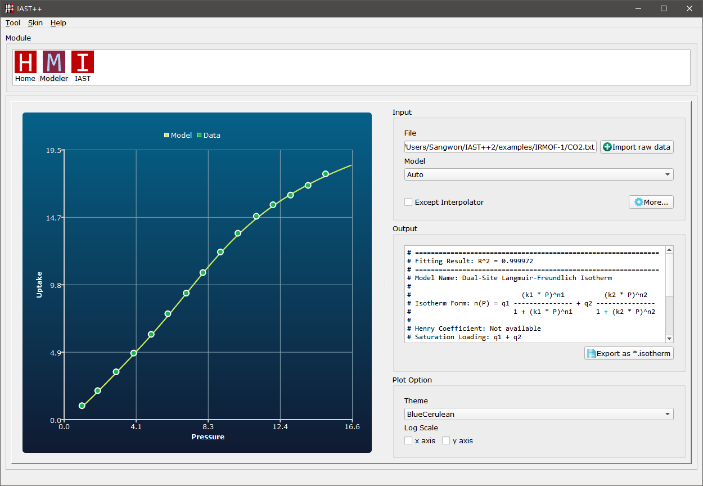
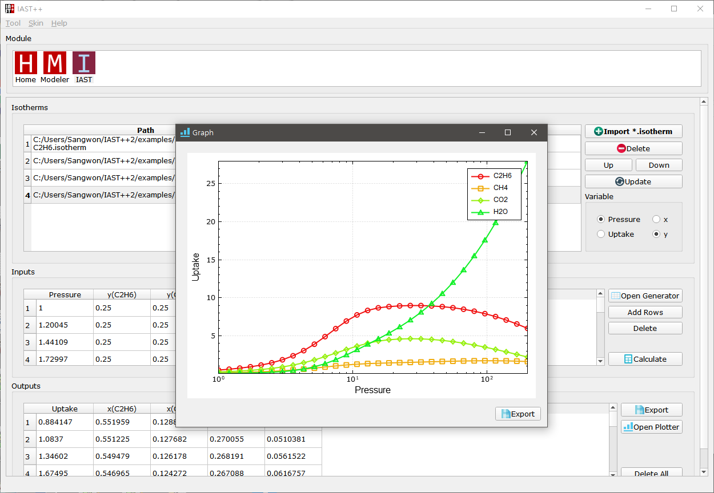

# IAST++ v1.0.1

### [Download Windows Version Installer (Direct download)](https://github.com/Sangwon91/IASTpp/releases/download/v1.0.1/iastpp_1.0.1_windows_installer.exe)
### [Download Windows Version Installer (Dropbox, FAST)](https://www.dropbox.com/s/u590qrxbr1ho522/iastpp_1.0.1_windows_installer.exe?dl=0)

## Information
* [Github](https://github.com/Sangwon91/IASTpp)
* [Video Demo](https://youtu.be/btTVnobOeWo)
* Company: [Molecular Simulation Group, KAIST](http://molsim.kaist.ac.kr)
* Developer: lsw91.main@gmail.com

* Please cite [me](https://link.springer.com/article/10.1007%2Fs11814-017-0269-9) if you find it useful!

## Snapshot

* `Modeler` module

* `IAST` module

